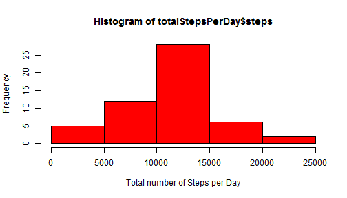
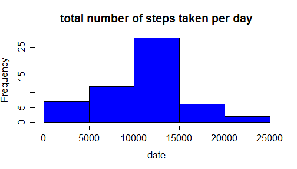
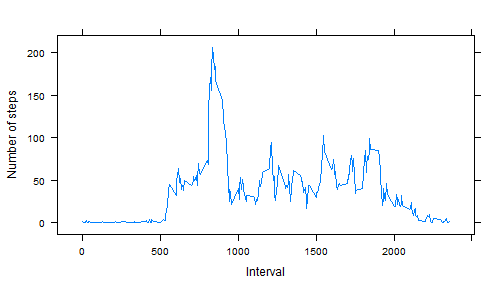

## Loading and preprocessing the data

Let's read the data from zip file into a dataframe.


```r
data <- read.csv(unz("activity.zip", "activity.csv"), header=T, quote="\"", sep=",",colClasses=c("numeric","character","numeric"),na.strings = "NA")

# transform the date
data.date=as.Date(data[,"date"],format="%d/%m%Y")
```

## What is mean total number of steps taken per day?

1. Here is a histogram of mean total number of steps taken per day

```r
totalStepsPerDay <- aggregate(steps~date,data=data,FUN=sum)
#png(file="figure/plot1.png",width=480,height=480)
hist(totalStepsPerDay$steps,col=c("red"),main="total number of steps taken per day",xlab="date")
```

 

```r
dev.off()
```

 

```
## RStudioGD 
##         2
```
2. This is the mean and median total number of steps taken per day.

```r
m1 <- mean(totalStepsPerDay[,2])
m2 <- median(totalStepsPerDay[,2])
```
The mean and median total number of steps taken per day are 1.0766189 &times; 10<sup>4</sup> and 1.0765 &times; 10<sup>4</sup> respectively.

## What is the average daily activity pattern?

1. This is a time series plot of the 5-minute interval and the average number of steps taken, averaged across all days.

```r
avgDailyData <- aggregate(steps~interval,data=data,FUN=mean)
#avgDailyData <- avgDailyData[order(avgDailyData$interval),]
#png(file="figure/plot2.png",width=480,height=480)
plot(avgDailyData$interval,avgDailyData$steps,xlab="interval",ylab="average steps across all days",type="l")
dev.off()
```

 

```
## RStudioGD 
##         2
```

2. Which 5-minute interval, on average across all the days in the dataset, contains the maximum number of steps?

```r
avgDailyData[avgDailyData$steps==max(avgDailyData$step),"interval"]
```

```
## [1] 835
```

## Inputing missing values


## Are there differences in activity patterns between weekdays and weekends?
