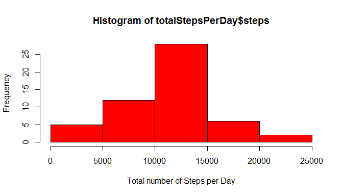
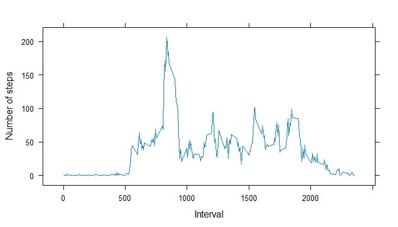
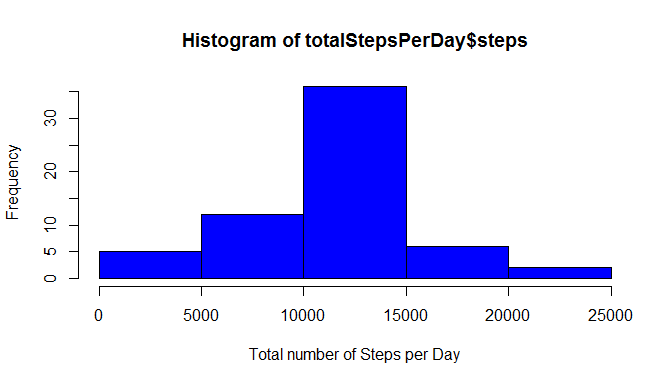

# Reproducible Research: Peer Assessment 1


## Loading and preprocessing the data

Load the data.


```r
data <- read.csv(unz("activity.zip", "activity.csv"), header=T, quote="\"", sep=",",colClasses=c("integer","Date","integer"))
```


## What is mean total number of steps taken per day?

Here is a histogram of total number of steps taken per day

```r
totalStepsPerDay <- aggregate(steps~date,data=data,FUN=sum)
hist(totalStepsPerDay$steps,col=c("red"),xlab="Total number of Steps per Day")
```

 

Calculating the mean and median total number of steps taken per day.

```r
m1 <- mean(totalStepsPerDay[,2])
m2 <- median(totalStepsPerDay[,2])
```
The mean and median total number of steps taken per day are 1.0766189\times 10^{4} and 10765 respectively.

## What is the average daily activity pattern?

This is a time series plot of the 5-minute interval and the average number of steps taken, averaged across all days.

```r
avgDailyData <- aggregate(steps~interval,data=data,FUN=mean)
library(lattice)
```

```
## Warning: package 'lattice' was built under R version 3.1.2
```

```r
xyplot(steps ~ interval , data = avgDailyData, type="l",xlab="Interval",ylab="Number of steps")
```

 

Which 5-minute interval, on average across all the days in the dataset, contains the maximum number of steps?

```r
avgDailyData[avgDailyData$steps==max(avgDailyData$step),"interval"]
```

```
## [1] 835
```

## Inputing missing values

Here is the total number of missing values in the dataset (i.e. the total number of rows with NAs).

```r
nrow(data[is.na(data$steps),])
```

```
## [1] 2304
```

Fill in the missing values using mean for the 5 minute interval.

```r
# calculate mean for each 5 minute interval
library(plyr)
```

```
## Warning: package 'plyr' was built under R version 3.1.2
```

```r
meanStepsByInterval <- ddply(data,.(interval),summarize,mean=mean(steps,na.rm=TRUE))
rownames(meanStepsByInterval) <- meanStepsByInterval[,"interval"]
# replace NA values
dataComplete <- data
dataComplete[is.na(dataComplete$steps),] <- ddply(dataComplete[is.na(dataComplete$steps),],.variables=.(interval),.fun=mutate,steps=meanStepsByInterval[as.character(interval),2])
```

Here is a histogram of total number of steps taken per day  

```r
totalStepsPerDay <- aggregate(steps~date,data=dataComplete,FUN=sum)
hist(totalStepsPerDay$steps,col=c("blue"),xlab="Total number of Steps per Day")
```

 

Calculating the mean and median total number of steps taken per day.

```r
m1 <- mean(totalStepsPerDay[,2])
m2 <- median(totalStepsPerDay[,2])
```
The mean and median total number of steps taken per day are 1.0766189\times 10^{4} and 1.0766189\times 10^{4} respectively.

As can be seen, the impact of filling in NA data is (1) no change to the mean(2) the median has become the same with the mean.

## Are there differences in activity patterns between weekdays and weekends?

Create a new factor variable in the dataset with the filled-in missing values with two levels -- "weekday" and "weekend" indicating whether a given date is a weekday or weekend day.


```r
l <- levels(as.factor(data$date))
w <- sapply(l,function(x) ifelse(weekdays(as.Date(x)) %in% c("Saturday","Sunday"),"weekend","weekday"))
dataComplete <- mutate(dataComplete, typeOfDay=w[as.character(date)])
```

This is a panel plot containing a time series plot (i.e. type = "l") of the 5-minute interval (x-axis) and the average number of steps taken, averaged across all weekday days or weekend days (y-axis).

```r
avgDailyData <- aggregate(steps~interval+typeOfDay,data=dataComplete,FUN=mean)
library(lattice)
xyplot(steps ~ interval | typeOfDay, data = avgDailyData, type="l", xlab="Interval",ylab="Number of steps", layout = c(1, 2))
```

 

As can be seeen from above, in general there is higher number of average steps during weekend compared to weekday for each 5-min interval during the  active intervals.
