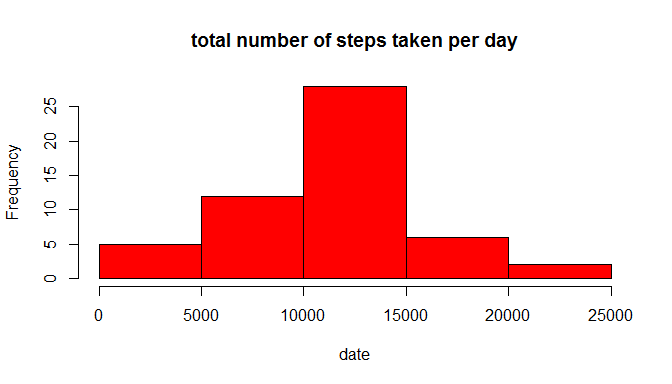
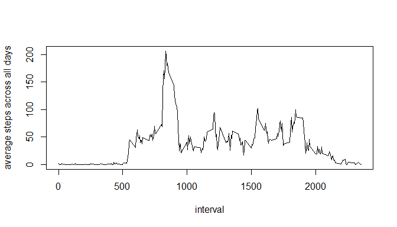
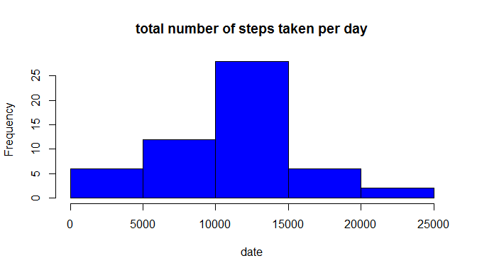

# Reproducible Research: Peer Assessment 1


## Loading and preprocessing the data

1. Load the data.


```r
data <- read.csv(unz("activity.zip", "activity.csv"), header=T, quote="\"", sep=",",colClasses=c("numeric","character","numeric"),na.strings = "NA")
```

2. Transform the date.

```r
# transform the date
data.date=as.Date(data[,"date"],format="%d/%m%Y")
```

## What is mean total number of steps taken per day?

1. Here is a histogram of mean total number of steps taken per day

```r
totalStepsPerDay <- aggregate(steps~date,data=data,FUN=sum)
hist(totalStepsPerDay$steps,col=c("red"),main="total number of steps taken per day",xlab="date")
```

 

```r
dev.off()
```

```
## null device 
##           1
```
2. Here are the mean and median total number of steps taken per day.

```r
m1 <- mean(totalStepsPerDay[,2])
m2 <- median(totalStepsPerDay[,2])
```
The mean and median total number of steps taken per day are 1.0766189\times 10^{4} and 1.0765\times 10^{4} respectively.

## What is the average daily activity pattern?

1. This is a time series plot of the 5-minute interval and the average number of steps taken, averaged across all days.

```r
avgDailyData <- aggregate(steps~interval,data=data,FUN=mean)
plot(avgDailyData$interval,avgDailyData$steps,xlab="interval",ylab="average steps across all days",type="l")
```

 

2. Which 5-minute interval, on average across all the days in the dataset, contains the maximum number of steps?

```r
avgDailyData[avgDailyData$steps==max(avgDailyData$step),"interval"]
```

```
## [1] 835
```

## Inputing missing values

1. Here is the total number of missing values in the dataset (i.e. the total number of rows with NAs).

```r
nrow(data[is.na(data$steps),])
```

```
## [1] 2304
```

2. Fill in the missing values using mean for that day.


```r
# calculate mean for each 5 minute interval
library(plyr)
```

```
## Warning: package 'plyr' was built under R version 3.1.2
```

```r
meanStepsByInterval <- ddply(data,.(interval),summarize,mean=mean(steps,na.rm=TRUE))
# replace NA values
dataComplete <- data;
for (i in nrow(dataComplete)) {
  if (is.na(dataComplete[i,"steps"]))
    dataComplete[i,"steps"] <- meanStepsByInterval[meanStepsByInterval$interval==dataComplete[i,"interval"],"mean"]
}
```

3. Here is a histogram of mean total number of steps taken per day

```r
totalStepsPerDay <- aggregate(steps~date,data=dataComplete,FUN=sum)
hist(totalStepsPerDay$steps,col=c("blue"),main="total number of steps taken per day",xlab="date")
```

 
4. Here are the mean and median total number of steps taken per day.

```r
m1 <- mean(totalStepsPerDay[,2])
m2 <- median(totalStepsPerDay[,2])
```
The mean and median total number of steps taken per day are 1.0566835\times 10^{4} and 1.06825\times 10^{4} respectively.

As can be seen, the impact of filling in NA data is that 

## Are there differences in activity patterns between weekdays and weekends?
